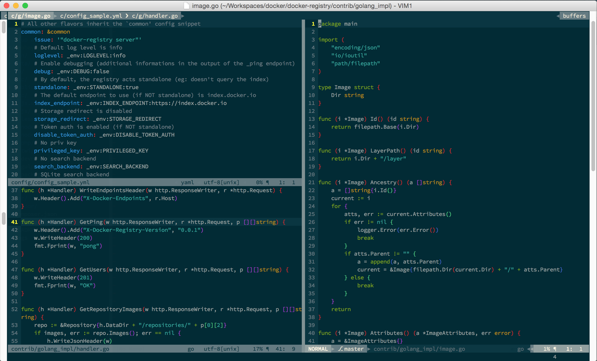

# INTRODUCTION

Vim plugins and configurations available for organization members.

Tranferred from fowox-vim, which is contributed by `samuelzhang` in his fowox group.

Thanks for the contribution.

# PREPARATION

install vim with lua

# INSTALLATION

./install.sh

# SCREENSHOTS

